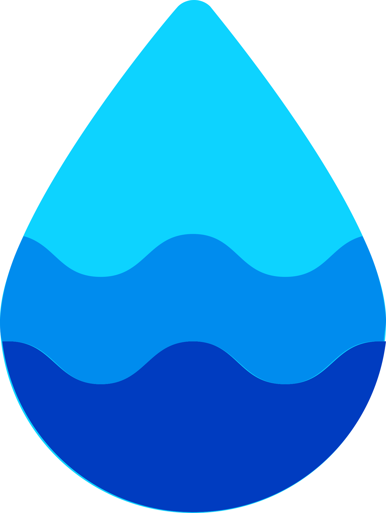
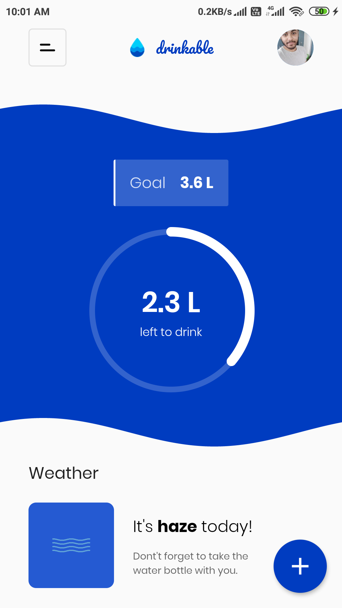
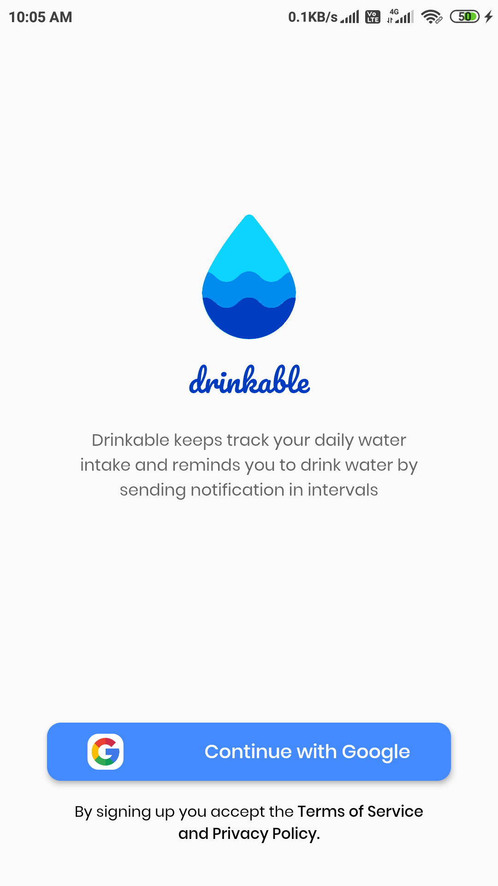
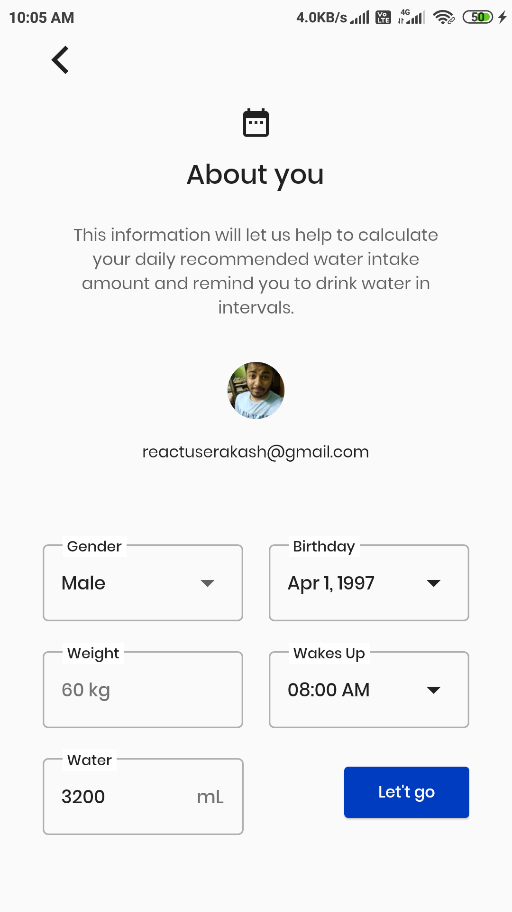
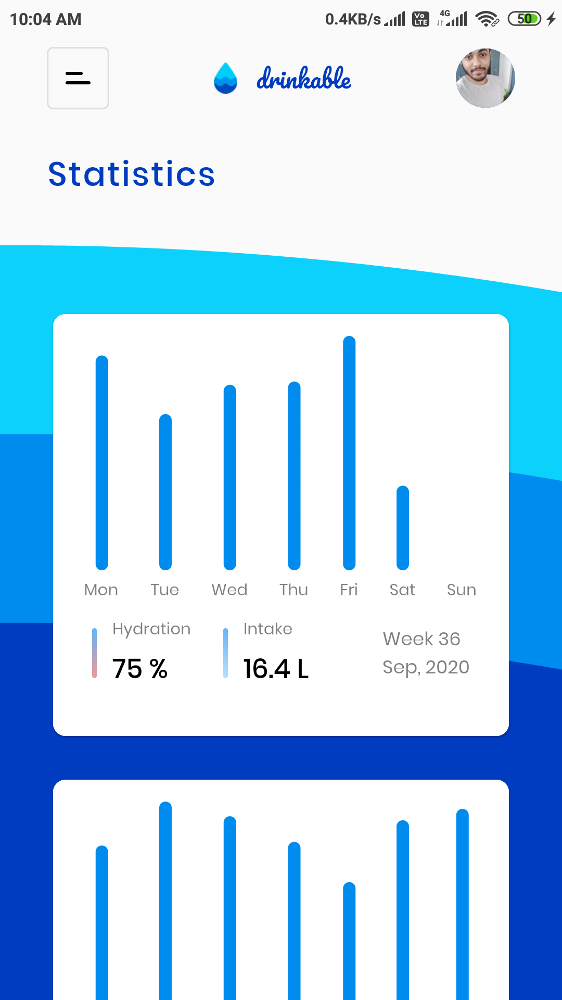
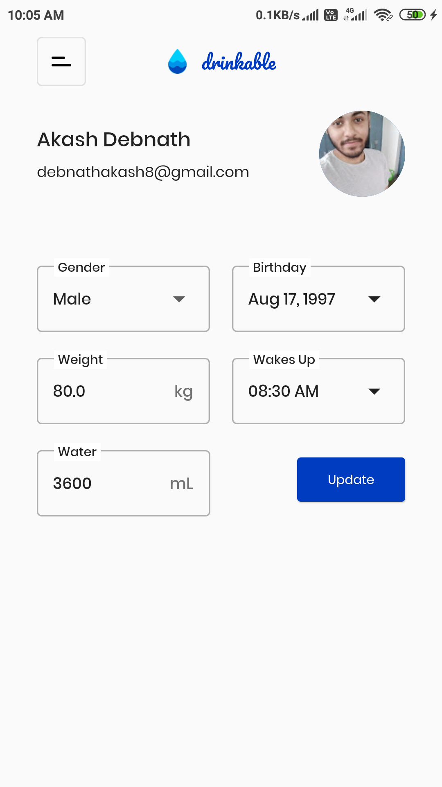
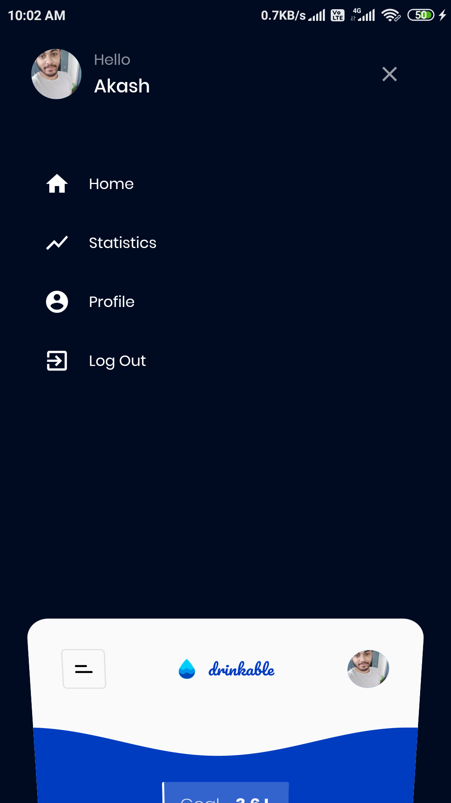

# Drinkable

<h1 align="center">
  
   🌊 Drinkable 🌊  
</h1>
<h2 align="center">
  Built with ❤︎ by
  <a href="https://github.com/noobcoder17">Akash Debnath</a>
  
Drinkable is a Flutter App powered by Firebase to keep track your daily water intake.

</h2>

<h1 align="center">
  
</h1>

In this app user will sign up using there Google Acount (Google Sign-In) and if he/she is a new user, then he/she have to fill a form with basic details like gender, age, weight. We also added the daily wake up time. It will be used in next version where user will be notified to drink water in intervals. By providing the basis information, your can get your recommended daily water intake which is editable.

   
   

Now once you signed up, you can add water that you consumned. You can track your intakes in Statistics screen.

In future if you want to update your profile data like you weight and get the recommended water intake automatically, then you can do it in profile page.

   
   

This app also access your location and gets the weather from <a href="https://openweathermap.org/">Open Weather</a> api of your location.

For this app I made a custom looking App Drawer.

   

I made this app for my own use and added it on GitHub so that others can use it also.

## Getting Started
Just Clone the repository and inside the repository run <i>flutter create .</i>

Create a Firebase project and add this app in the firebase project with SHA-1 and SHA-256 hash of your signing certificate. Follow the instructions and add <i>google-services.json</i> file in Adroid's App level directory. Then enable Google Sing-In from Firebase Authentication's Sign-In Methods.

Then connect your emulator and run the app by <i>flutter run</i>

You are GoodToGo.

**Free Software, Hell Yeah!**
